# 🎵 Offline Music Player (Flutter)

**Offline Music Player** là ứng dụng nghe nhạc **offline** được xây dựng bằng **Flutter**, cho phép phát nhạc trực tiếp từ bộ nhớ thiết bị với giao diện hiện đại, quản lý album người dùng, yêu thích bài hát và nhiều tính năng âm thanh nâng cao.

---

## ✨ Tính năng chính

### 🎶 Thư viện nhạc
- Quét và hiển thị **toàn bộ bài hát** trong bộ nhớ thiết bị
- Sắp xếp bài hát theo:
  - **Tên bài hát (Title)**
  - **Nghệ sĩ (Artist)**
  - **Album**
  - **Ngày thêm (Date Added)**
- Tìm kiếm **real-time** theo:
  - Tên bài hát
  - Nghệ sĩ
  - Album

---

### ❤️ Yêu thích (Favorites)
- Đánh dấu / bỏ đánh dấu bài hát yêu thích
- Hiển thị danh sách nhạc yêu thích
- Trạng thái yêu thích được đồng bộ toàn app

---

### 📁 Album người dùng (Custom Albums)
- Tạo **album tùy chỉnh** do người dùng đặt tên
- Khi thêm bài hát vào album:
  - Chọn **album đã tạo**
  - Hoặc **tạo album mới**
- Màn hình Album **chỉ hiển thị album do người dùng tạo**
- Phát nhạc:
  - Từng bài trong album
  - Toàn bộ album
- Có thể **xóa bài hát khỏi album**

---

### ▶️ Phát nhạc
- Play / Pause / Next / Previous
- Phát nhạc nền (background playback)
- **Mini Player** luôn hiển thị
- Màn hình **Now Playing**:
  - Ảnh album
  - Thanh tiến trình
  - Điều khiển phát nhạc

---

### 🔊 Điều khiển âm thanh
- Điều chỉnh **âm lượng**
- Điều chỉnh **tốc độ phát** (0.5x – 2.0x)
- **Shuffle** (phát ngẫu nhiên)
- **Repeat**:
  - OFF
  - ALL
  - ONE

---

### 🎚 Equalizer (EQ)
- Preset:
  - Normal
  - Bass Boost
  - Custom
- Equalizer **5 dải tần**
- Giao diện sẵn sàng mở rộng xử lý âm thanh nâng cao

---

### ⏱ Sleep Timer
- Hẹn giờ tắt nhạc:
  - 15 phút
  - 30 phút
  - 60 phút
- Tự động dừng nhạc khi hết thời gian

---

### 📤 Tùy chọn bài hát
- Play now
- Thêm / xóa khỏi yêu thích
- Thêm / xóa khỏi album
- Xem thông tin nghệ sĩ
- Chia sẻ bài hát
- Xem thống kê bài hát
- Xuất thông tin bài hát dưới dạng **JSON**

---

## 🖼️ Giao diện ứng dụng

### 🏠 Trang chủ
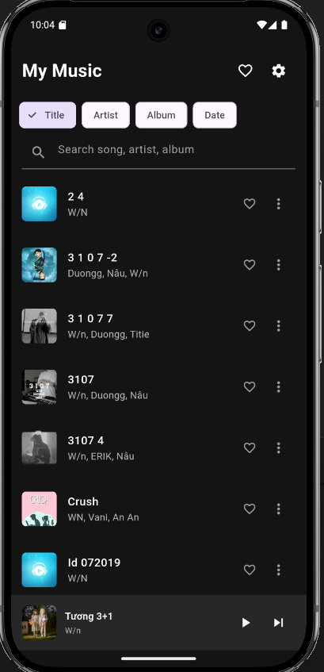

### 🎵 Trình phát nhạc
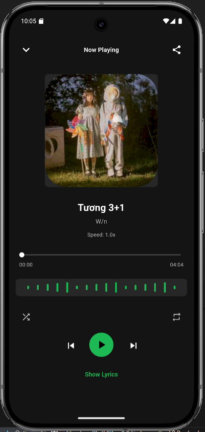

### 📁 Album 
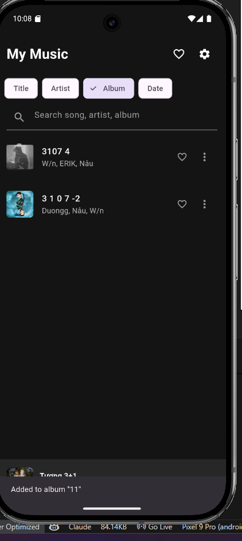

### 📂 Album Folder
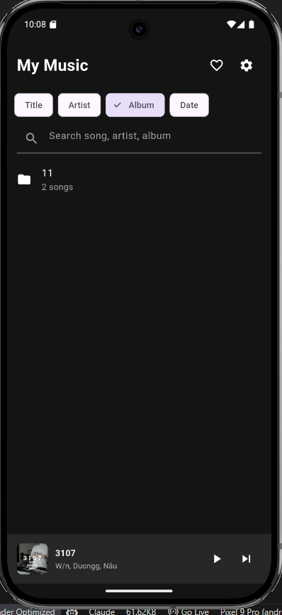

### ➕ Thêm nhạc vào Album
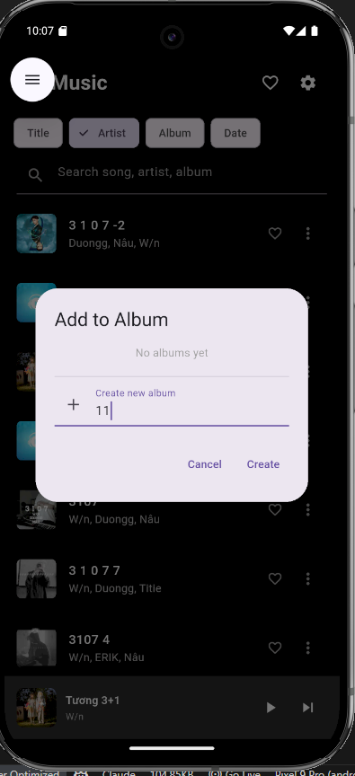

### 🎤 Nghệ sĩ
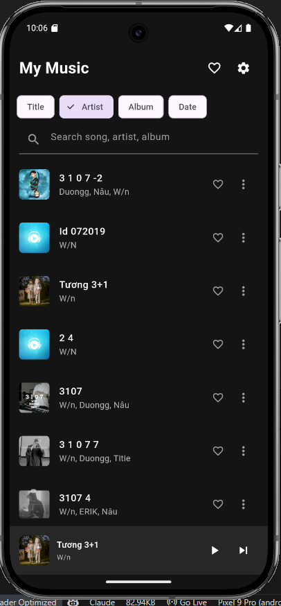

### ❤️ Yêu thích
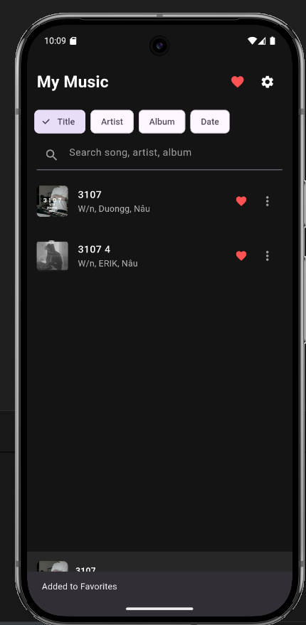

### 📅 Sắp xếp theo ngày
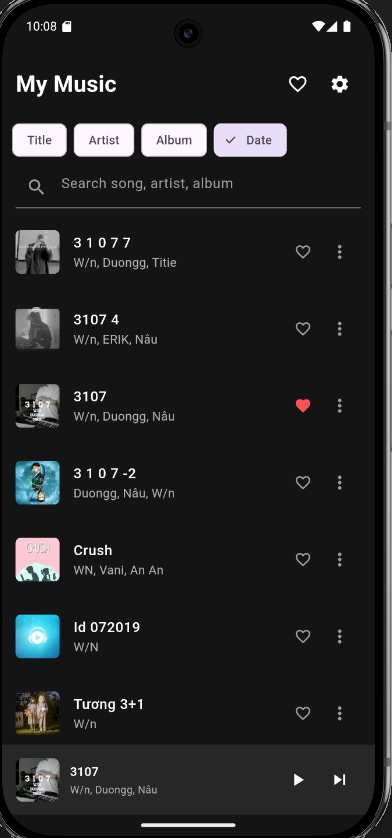

### 📤 Chia sẻ
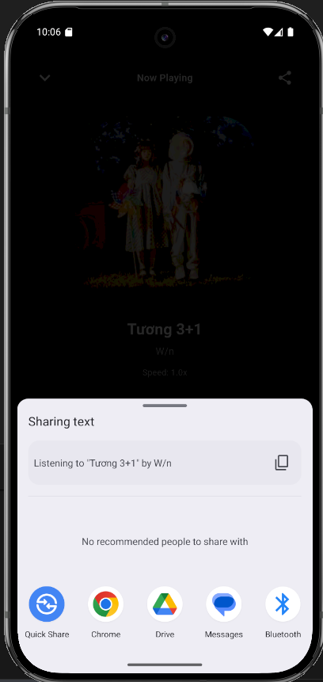

### 📄 Menu tùy chọn
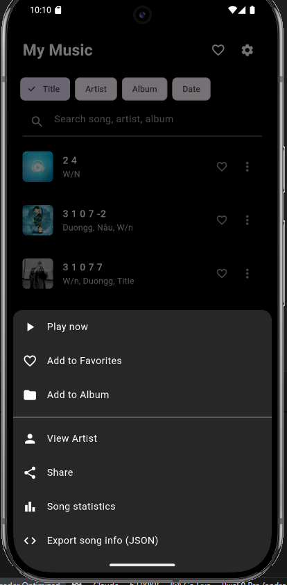

### ⚙️ Cài đặt 1
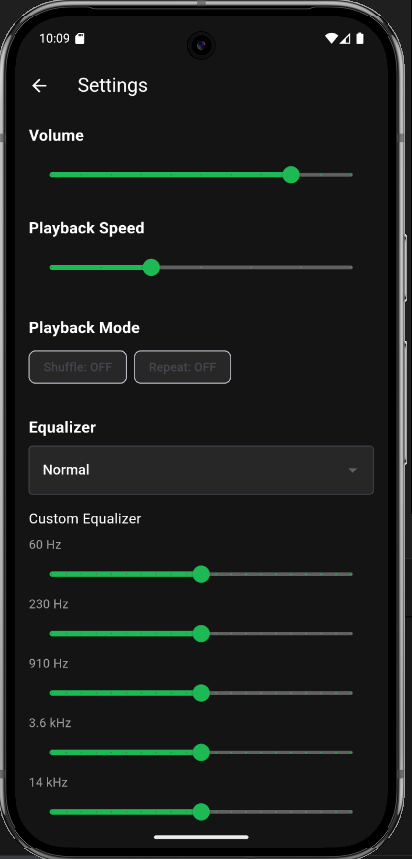

### 🎚️ Cài đặt 2
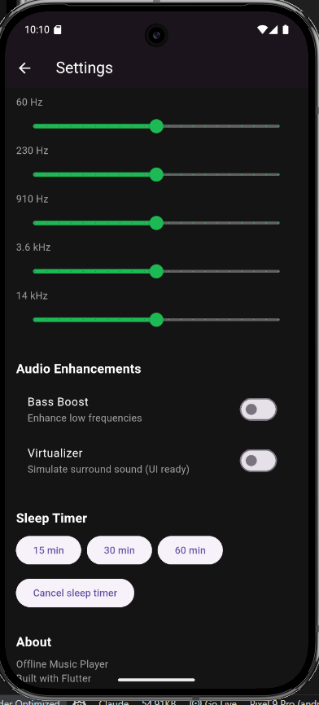

---

## 🧱 Cấu trúc thư mục

### 📂 Thư mục `lib`
```text
lib/
├── main.dart
│
├── models/
│   ├── playback_state_model.dart
│   ├── playlist_model.dart
│   └── song_model.dart
│
├── providers/
│   ├── audio_provider.dart
│   ├── playlist_provider.dart
│   └── theme_provider.dart
│
├── screens/
│   ├── all_songs_screen.dart
│   ├── home_screen.dart
│   ├── now_playing_screen.dart
│   ├── playlist_screen.dart
│   └── settings_screen.dart
│
├── services/
│   ├── audio_player_service.dart
│   ├── permission_service.dart
│   ├── playlist_service.dart
│   └── storage_service.dart
│
├── utils/
│   ├── color_extractor.dart
│   ├── constants.dart
│   └── duration_formatter.dart
│
└── widgets/
    ├── album_art.dart
    ├── mini_player.dart
    ├── player_controls.dart
    ├── playlist_card.dart
    ├── progress_bar.dart
    └── song_tile.dart


---

---
```
## 🏗 Kiến trúc ứng dụng

* **State Management**: Provider
* **Kiến trúc**: MVVM (UI – State – Logic – Data)
* Dễ mở rộng, dễ bảo trì, phù hợp project thực tế

---

## 📦 Thư viện sử dụng

```yaml
dependencies:
  flutter:
    sdk: flutter

  cupertino_icons: 1.0.8
  just_audio: 0.9.36
  audio_service: 0.18.12
  audio_session: 0.1.18
  provider: 6.1.1
  rxdart: 0.27.7
  share_plus: ^7.2.1
  shared_preferences: 2.2.2
  path_provider: 2.1.1
  permission_handler: 11.1.0
  on_audio_query: 2.9.0
  palette_generator: 0.3.3+3
  cached_network_image: 3.3.0
  metadata_god: ^0.5.2

dev_dependencies:
  flutter_test:
    sdk: flutter
  flutter_lints: 6.0.0
  flutter_launcher_icons: 0.13.1
  mocktail: ^1.0.0
flutter:
  uses-material-design: true

  assets:
    - assets/audio/sample_songs/
    - assets/images/
```

---

## 🔐 Quyền truy cập

* Truy cập bộ nhớ / media
* Phát nhạc nền
  → Được xử lý tự động qua `PermissionService`

---

## 🚀 Cách chạy ứng dụng

```bash
cd offline_music_player
flutter pub get
flutter run
```

---

## 🎓 Mục tiêu học tập

Dự án giúp rèn luyện:

* Flutter UI nâng cao
* Truy cập media local Android
* Audio playback
* Provider state management
* Tổ chức project Flutter chuẩn thực tế

---

## 👨‍💻 Tác giả

* Nguyễn Thế Chương
* 2224802010930


